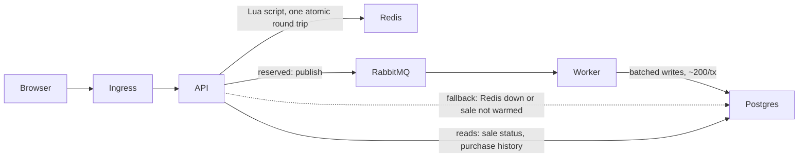
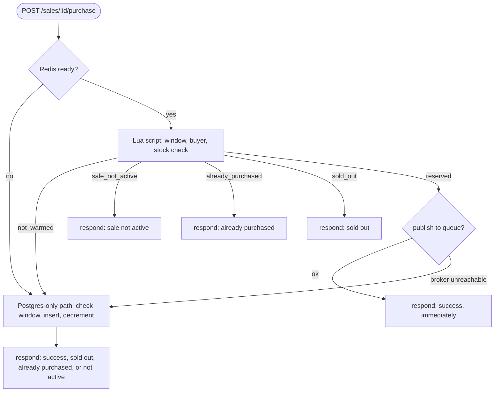

# High-Throughput Flash Sale System

Single-product flash sale: configurable window, limited stock, one item per user, no overselling under concurrency.

**Stack:** Turborepo, NestJS, React (react-router), PostgreSQL, Redis, RabbitMQ, Docker Compose, k6.

---

## Table of contents

- [Requirements coverage](#requirements-coverage)
- [Design choices and trade-offs](#design-choices-and-trade-offs)
- [System diagram](#system-diagram)
- [Getting started](#getting-started)
- [Seeding data](#seeding-data)
- [Running tests](#running-tests)
- [Stress tests and expected outcome](#stress-tests-and-expected-outcome)

---

## Requirements coverage

| Requirement                   | Where                                                                                                                      |
| ----------------------------- | -------------------------------------------------------------------------------------------------------------------------- |
| Configurable sale window      | `sales.startsAt/endsAt`, enforced in the Redis reservation script and by a DB trigger (`trg_purchases_within_sale_period`) |
| Single product, limited stock | `packages/database/src/schema/sales.ts`, `products.ts`                                                                     |
| One item per user             | `unique("purchases_one_per_user_per_sale")` on `(sale_id, email)`, `packages/database/src/schema/purchases.ts:22`          |
| Sale status endpoint          | `GET /api/sales?status=active\|upcoming\|past`                                                                             |
| Purchase attempt endpoint     | `POST /api/sales/:id/purchase`                                                                                             |
| Check if user's order history | `GET /api/purchases?email={email}`                                                                                         |
| Frontend                      | `apps/web` (React, react-router)                                                                                           |
| System diagram                | see below                                                                                                                  |
| Unit and integration tests    | `*.test.ts(x)` per workspace, `apps/api/test/*.e2e.test.ts`                                                                |
| Stress tests                  | `packages/load-test` (k6)                                                                                                  |

> NOTE: full API docs are generated at runtime, see [Getting started](#getting-started).

---

## Design choices and trade-offs

**Postgres, for the rule that cannot be allowed to fail.** One item per user is a uniqueness constraint, so it belongs in a database that enforces it, not in application logic that can race. `unique(sale_id, email)` makes a duplicate purchase impossible even if every layer above it is wrong. Stock never goes negative because the decrement is guarded by `WHERE remaining_stock > 0` in the same transaction as the insert. Trade-off: a transactional write is not cheap enough to be on the request path at flash sale volume (see stress tests below), so Postgres could not stay the write-per-request database.

**Redis, because most requests are losers.** Once a sale is popular, almost every request is a rejection: sold out, already bought, or the window is closed. Answering those from Postgres burns database capacity on purchases that will never exist. One Lua script (`packages/redis/lua/reserve-purchase.lua`) checks window, buyer, and stock, then decrements, all in one atomic round trip, since Redis executes a script single threaded. Trade-off: stock now lives in two places, which is why a sale must be warmed before its fast path engages, and why the fallback below exists.

**RabbitMQ, to take Postgres off the request path.** By the time Redis says `reserved`, every decision that matters is already made. The write is published to a queue and the API responds immediately; a separate worker drains it into Postgres in batches of ~200. Trade-off: stock counts and order history can lag Redis by roughly queue depth during a burst, and a batch that exhausts its retries dead-letters (logged, not retried further); there is no reconciliation job.

**Fail open, not closed.** Redis down, or the sale never warmed: fall back to the Postgres-only path. Broker unreachable: fall back to the synchronous write rather than lose a purchase Redis already committed to. Degrade the experience before you lose a sale.

**OUT OF SCOPE:** no reconciliation for dead-lettered writes, no payment step, no auth beyond an email identifier as the buyer's key.

---

## System diagram

### Architecture



### Purchase decision flow



---

## Getting started

### Prerequisites

- Node.js and npm
- Docker and Docker Compose

`npm install` detects and installs anything else needed (Linux and macOS); set `SKIP_DEPS_CHECK=1` to skip, or run it on demand with `npm run setup:deps`.

```bash
npm install           # installs deps, checks for missing local tooling
cp .env.example .env  # local env, if you don't already have one
npm run setup         # migrate + seed Postgres, warm Redis, start RabbitMQ
npm run dev           # runs api + web together via Turbo
```

> NOTE: if you changed `packages/database/src/schema/`, generate a migration first with `npm run -w @workspace/database db:generate`. That is a schema-authoring step, separate from `npm run setup`.

> NOTE: the purchase fast path only engages for a sale that has been warmed into Redis. A cold sale falls through to the same Postgres-only flow described above.

| Runs at  | What                                        |
| -------- | ------------------------------------------- |
| API      | `http://localhost:3000/api` (or `API_PORT`) |
| API docs | `http://localhost:3000/docs`                |
| Web      | Vite dev server, printed by `npm run dev`   |

---

## Seeding data

`npm run setup` already seeds once as part of bootstrap. Use the commands below to reseed later, for example after truncating tables by hand or testing against a fresh sale.

```bash
npm run -w @workspace/database db:seed  # truncates products/sales/purchases, inserts fixtures
npm run -w @workspace/redis redis:warm  # re-syncs Redis from Postgres (stock, buyers, window)
```

`db:seed` (`packages/database/src/scripts/seed.ts`) truncates `purchases`, `sales`, `products` (cascading) and inserts 7 products and 7 sales: 1 past, 3 currently active (one nearly sold out, one ending in a few minutes), 3 upcoming, plus a handful of purchases against the past and active sales.

> NOTE: reseeding only touches Postgres. Run `redis:warm` right after, or the active sales in Redis will still reflect the old data until the next warm.

On the k8s cluster, use the dedicated script instead:

```bash
k8s/scripts/seed.sh   # destructive: truncates and reseeds Postgres, then warms Redis
k8s/scripts/warm.sh   # non-destructive: re-warms Redis from Postgres only
```

> NOTE: `k8s/scripts/seed.sh` is never run by `deploy.sh`; run it yourself when you want fresh data.

---

## Running tests

```bash
npm run test          # unit tests, every workspace with a test script
npm run -w web test   # React components and hooks
npm run -w api test   # NestJS controllers and services
npm run test:e2e      # integration tests, real Postgres and Redis
```

The integration suite's concurrency case, `apps/api/test/concurrency.e2e.test.ts`, fires concurrent purchase attempts at one sale and asserts no overselling and no duplicate purchases directly against Postgres.

---

## Stress tests and expected outcome

```bash
k8s/scripts/setup.sh                        # deploys the local kind cluster first, see k8s/README.md
k8s/scripts/load-test.sh smoke              # 1 VU, 30s, sanity check
k8s/scripts/load-test.sh flash-sale-spike   # thundering herd on a stock limited sale
```

### Results: inline write vs. queued write

| Target rate | Architecture                                                                                                                                | Achieved  | Dropped | p95 latency |
| ----------- | ------------------------------------------------------------------------------------------------------------------------------------------- | --------- | ------- | ----------- |
| 800/s       | inline Postgres write                                                                                                                       | 599.9/s   | 0%      | 3.3ms       |
| 1600/s      | inline Postgres write                                                                                                                       | 767.5/s   | 26.4%   | 17,026.1ms  |
| 3200/s      | inline Postgres write                                                                                                                       | 129.1/s   | 81.8%   | 220,157.4ms |
| 1600/s      | inline Postgres write + [increased CPU headroom](https://github.com/jaypeeig/sd-flash-sale/commit/41475fad39c9fffa8f02e7a4f4df0e5ee373b5b1) | 832.9/s   | 20.1%   | 15,945.8ms  |
| 1600/s      | + Redis reservation, queued write                                                                                                           | 1,199.8/s | 0%      | 3.9ms       |
| 3200/s      | + Redis reservation, queued write                                                                                                           | 2,399.8/s | 0%      | 22.6ms      |

> NOTE: achieved rate tops out around 75% of target in both queued runs. That is a k6 VU-scheduling ceiling in this test's configuration, not a system limit; the API showed no strain at either rate once the queue was in place.

**Expected outcome:** each run seeds a fresh sale, warms Redis, runs k6, then verifies the invariants directly against Postgres: `total_stock - remaining_stock` equals the purchase count, and no email has more than one purchase for the sale. Every run, across every architecture tested (including the runs above with p95 in the tens of seconds), held both invariants. Speed was the variable; correctness never was. Results land in `packages/load-test/results/<label>/`.

Key env vars: `ARRIVAL_RATE`, `DURATION_SECONDS`, `STOCK`, `MAX_VUS`. Full list and defaults in `packages/load-test/k6/config/environment.ts`.

Full three-iteration write-up (why the inline write falls over, why more CPU didn't fix it, why the queue did): [docs/load-testing-overview.md](docs/load-testing-overview.md).
