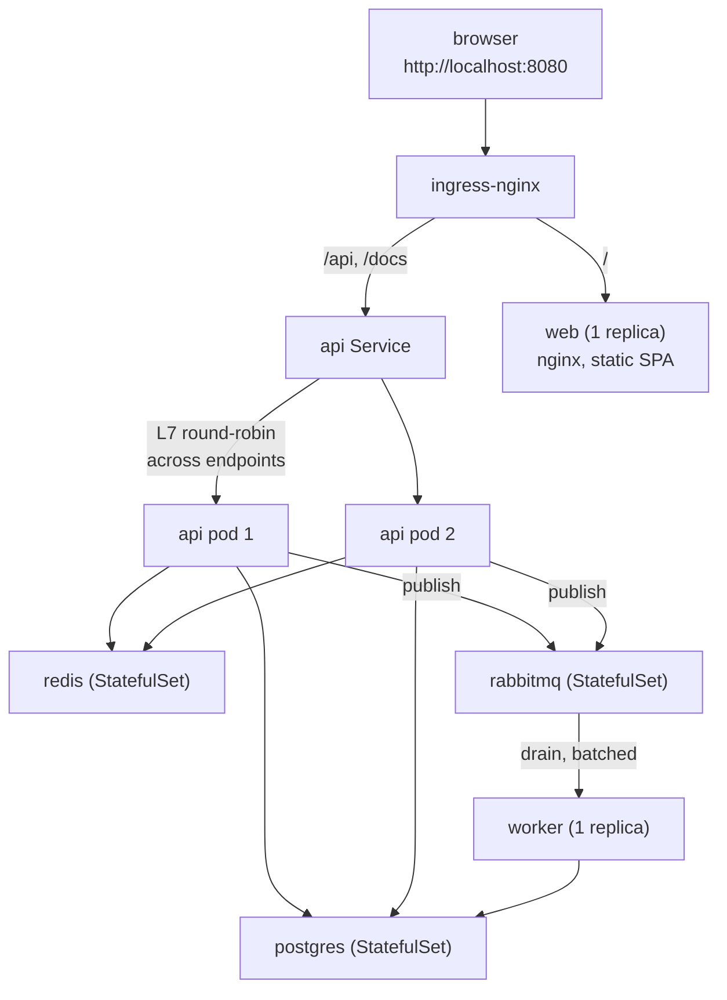

# Local Kubernetes deploy (kind)

## Topology



The SPA is built with `VITE_API_URL=/api` (same-origin) - `web` serves
static files only, the Ingress routes `/api`/`/docs` straight to `api`.

A Redis-confirmed purchase is handed to RabbitMQ instead of written to
Postgres inline - `api` responds immediately, and `worker` drains the queue
into Postgres in batches. `worker` has no HTTP surface, so it has no
liveness/readiness probes - a broker or Postgres it can't reach makes it
crash on boot, and Kubernetes' restart policy is the retry.

## Quick start

```bash
k8s/scripts/setup.sh           # cluster-up → build-images → deploy → seed, prints endpoints
```

Needs Docker, [`kind`](https://kind.sigs.k8s.io/docs/user/quick-start/#installation),
and [`kubectl`](https://kubernetes.io/docs/tasks/tools/#kubectl) -
`cluster-up.sh` checks for the latter two and prints an install link if
either is missing. No Helm.

Then open **http://localhost:8080/** (docs at **http://localhost:8080/docs**).

## Scripts

| script                | what it does                                                                                                                 |
| --------------------- | ---------------------------------------------------------------------------------------------------------------------------- |
| `setup.sh [--yes]`    | runs all four steps below in order, then prints the Ingress/Service/Endpoints and app URLs                                   |
| `cluster-up.sh`       | create the `flash-sale` kind cluster (if it doesn't exist) + install ingress-nginx                                           |
| `build-images.sh`     | build the `api`/`web`/`ops`/`worker` images from their own `docker/*.Dockerfile`, `kind load` them                           |
| `validate.sh`         | validate every manifest against the Kubernetes API schema via `kubeconform` (not a style linter - oxlint doesn't cover YAML) |
| `deploy.sh`           | apply `overlays/local`, wait for postgres/redis/rabbitmq, run migrations to completion, roll out api + worker + web          |
| `seed.sh [--yes]`     | **destructive** - truncates and re-seeds Postgres, then warms Redis. Never run by `deploy.sh`.                               |
| `warm.sh`             | non-destructive - re-warms Redis from Postgres only (e.g. after a Redis pod restart)                                         |
| `load-test.sh [args]` | runs `packages/load-test`'s k6 suite against the cluster (port-forwards postgres/redis/rabbitmq, targets the Ingress)        |
| `down.sh [--cluster]` | delete the `flash-sale` namespace (app + PVCs); `--cluster` also deletes the kind cluster                                    |
